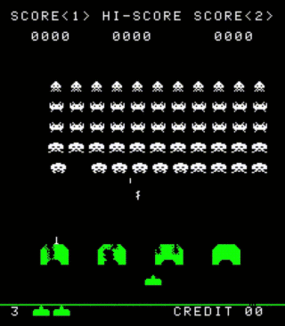

# Space-Invaders

Space Invaders (Japanese: スペースインベーダー Hepburn: Supēsu Inbēdā) is a 1978 arcade game created by Tomohiro Nishikado. It was manufactured and sold by Taito in Japan, and licensed in the United States by the Midway division of Bally. Within the shooter genre, Space Invaders was the first fixed shooter and set the template for the shoot 'em up genre. The goal is to defeat wave after wave of descending aliens with a horizontally moving laser to earn as many points as possible.

```sh
$ cargo run
```

- Press `C` to insert a coin
- Press `1` to start player 1
- Press `Q` to move left
- Press `E` to move right
- Press `W` to fire

The game uses an **Intel 8080 central processing unit (CPU)**, displays raster graphics on a CRT monitor, and uses monaural sound hosted by a combination of analog circuitry and a Texas Instruments SN76477 sound chip.



I use a separate repo to implement the i8080 CPU, please goto [https://github.com/mohanson/i8080](https://github.com/mohanson/i8080) to learn more.

# Specs

- [http://computerarcheology.com/Arcade/SpaceInvaders/Hardware.html](http://computerarcheology.com/Arcade/SpaceInvaders/Hardware.html)

# Licences

MIT
